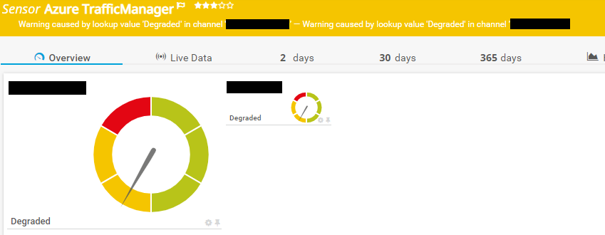

<!-- ABOUT THE PROJECT -->
### About The Project
Project Owner: Jannos-443

PRTG Powershell Script to monitor Microsoft Azure Traffic Manager

Free and open source: [MIT License](https://github.com/Jannos-443/PRTG-Azure/blob/main/LICENSE)

**Features**
* Monitor TrafficManager Profiles

## HOW TO

1. Place `PRTG-Azure-TrafficManager.ps1` under `C:\Program Files (x86)\PRTG Network Monitor\Custom Sensors\EXEXML`

2. Create AzureAD App
   - Open Azure AD
   - Register new APP
   - Overview >> Get Application ID
   - Certificates & secrets >> new Secret >> unlimited
   - Azure Create Custom Role
      - "Microsoft.Network/trafficManagerProfiles/read",
      - "Microsoft.Network/trafficManagerProfiles/externalEndpoints/read",
      - "Microsoft.Network/trafficManagerProfiles/nestedEndpoints/read",
      - "Microsoft.Network/trafficManagerProfiles/azureEndpoints/read",
      - "Microsoft.Network/trafficManagerProfiles/providers/Microsoft.Insights/logDefinitions/read",
      - "Microsoft.Network/trafficManagerGeographicHierarchies/read",
      - "Microsoft.Network/trafficManagerProfiles/providers/Microsoft.Insights/metricDefinitions/read",
      - "Microsoft.Network/trafficManagerUserMetricsKeys/read"
or follow this Guide: [Paessler Azure Custom Role](https://kb.paessler.com/en/topic/88625-how-do-i-obtain-credentials-and-create-custom-roles-for-the-microsoft-azure-sensors)

3. Create new Sensor
   - EXE/Script Advanced = `PRTG-Azure-TrafficManager.ps1`
   - Parameter = `-ApplicationID 'Test-APPID' -TenatId 'Test-TenantID' -AccessSecret 'Test-AppSecret' -SubscriptionId 'xxx...xxx'`

4. Set your own Channel limits if needed

## Usage

```powershell
-ApplicationID 'xxx...xxx' -TenatId 'xxx...xxx' -AccessSecret 'YourSecretKey' -SubscriptionId 'xxx...xxx'
```
Show all Profiles from a specific subscription

```powershell
-resourceGroupName "Test-Resources"
```
Show all Profiles from a specific subscription and resource group

```powershell
-IncludeProfileName '^(Test123.*|Test555)$'
```
Include/Exclude Profiles

Example Output:





For more information about regular expressions in PowerShell, visit [Microsoft Docs](https://docs.microsoft.com/en-us/powershell/module/microsoft.powershell.core/about/about_regular_expressions).
